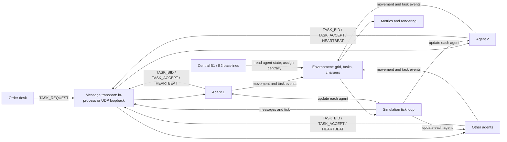

# System architecture

## Decision and data flow

## Main components

- `simulation.py`: advances ticks, creates orders, delivers bus messages, and updates agents in shuffled order.
- `agent.py`: local state, bid calculation, auction ledger, task queue, heartbeats, failure detection, recovery, charging, and movement.
- `communication.py`: default in-process delivery, simulated delay/loss, transmission counters, and the auction audit trail shown by the UI.
- `socket_bus.py`: optional localhost UDP transport. It serializes the same messages into datagrams so they can be inspected on the loopback network interface; agents and the simulation still run in one Python process.
- `environment.py`: true grid, obstacles, chargers, task lifecycle, and ground-truth event recording.
- `pathfinding.py`: A* route search on the grid.
- `baseline_dispatcher.py`: intentionally centralized nearest-idle and battery-aware strategies.
- `metrics.py`: derives summary values from completed simulation events.
- `main.py`: Pygame rendering and user controls; it displays decisions and state but does not choose auction winners.

## Where are decisions made?

In auction mode, each agent calculates its own bid and independently resolves the bids it received. There is no central auction winner function. The deterministic rule is lowest cost, then lower agent ID. With message loss, agents can see different bid sets; the UI can show conflicting accept claims when this happens.

The order desk announces a new task, and the environment owns ground truth for the map and task status. Obstacle changes are delivered directly to each agent as simulation events. The simulated bus is an in-process component, not a real network.

The B1 and B2 strategies are central by design: the dispatcher reads agent state and assigns tasks. B2 also sees failures immediately. They are comparison baselines, not decentralized modes.

## Optional localhost transport

The normal simulator and all experiment suites use the deterministic in-process bus. Launching `python main.py --udp` selects a UDP loopback transport for auction messages. Each simulated agent has a local UDP endpoint; the bus still controls logical tick delivery, message-loss settings, and metrics. This makes actual localhost datagrams visible to packet-capture tools, but it does not turn the agents into separate processes or model a production network.

## Message purposes

| Message | Purpose |
|---|---|
| `TASK_REQUEST` | Order desk announces a task and auction epoch. |
| `TASK_BID` | Agent announces its cost for that task and epoch. |
| `TASK_ACCEPT` | Winning agent announces ownership. |
| `DELIVERY_COMPLETE` | Agent announces a completed delivery. |
| `HEARTBEAT` | Agent reports that it is alive and shares position/status. |
| `AGENT_FAILURE` | Peer announces that an agent is considered failed. |
| `TASK_REASSIGN` | Peer announces a new auction epoch for orphaned work. |

## Communication partition and reconnection

Press `P` to split auction vehicles into two groups. Agent-to-agent messages only reach vehicles in the same group, so each side can run a local auction and temporarily assign the same order. The order desk can still announce customer requests to both groups; it does not select an owner. Press `P` again to restore links. Each vehicle broadcasts its task ledger and recipients reconcile ownership; matching bids are resolved by the existing cost-then-agent-ID rule. The feed reports partition, restoration, synchronization, and ownership conflicts.

This is deterministic simulation logic using a shared in-process bus and environment. It demonstrates local operation and reconciliation behavior; it does not establish formal consensus or model a production network.

## How to explain decentralization honestly

Say: “Task allocation and failure suspicion are decided by individual agents from messages and local ledgers. The prototype still runs every agent and the message bus in one process, and the environment provides shared ground truth and simulated events.” Do not describe it as a distributed deployment or real vehicle-to-vehicle network.
